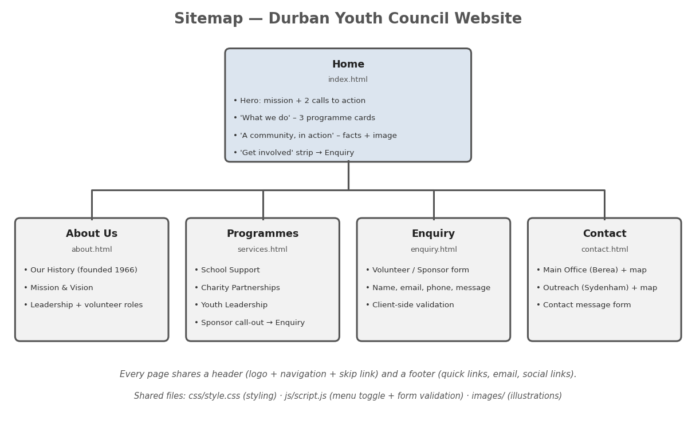

# Durban Youth Council — Website Project

**Module:** WEDE5020 · **Student:** Joshua David Whittle · **Student number:** St10532727
**Repository:** wede5020-g1-2026-formative-1-part-1-jwhittle-dev

## Project overview
Durban Youth Council (DYC) is a Durban-based, all-volunteer non-profit established in 1966 (Wikipedia, n.d.).
Its domain currently shows only a "New Website Coming Soon" placeholder, so this project builds a functional,
informative site that explains DYC's mission and turns visitors into volunteers, partners or sponsors.

Two organisations were proposed (see [Reports](Reports/README.md)): **Durban Youth Council** (built) and
**The Baking Pan** (not built).

## Repository structure
```
/
├── README.md                      <- this file (overview, features, changelog link, references)
├── CHANGELOG.md                   <- full record of development and feedback edits
├── Reports/                       <- proposal reports (goals, analysis, features, design, wireframes,
│   │                                 technical requirements, timeline, budget, two proposals)
│   └── wireframes/                <- SVG wireframes (5 desktop pages + mobile home)
├── Content_Research_and_Sourcing/ <- research, sources, page copy, asset sourcing
│   ├── page-content/  images/  documents/  text/
│   ├── sources.md  assets-sourcing.md
└── Durban_Youth_Council_Website/
    └── durban-youth-council/      <- the website
        ├── index.html  about.html  services.html  enquiry.html  contact.html
        ├── css/style.css
        ├── js/script.js
        └── images/                <- SVG illustrations, favicon and sitemap.png
```

## Website goals and objectives
Summarised below; full detail in [Reports/01-goals-and-objectives.md](Reports/01-goals-and-objectives.md).
- Communicate DYC's mission and programmes clearly to first-time visitors.
- Convert visitors into volunteer or sponsor enquiries.
- Make contact details for both DYC locations easy to find.
- Be accessible and work on any device.

## Key features and functionality
- Five linked pages: Home, About Us, Programmes, Enquiry, Contact.
- Semantic HTML5 (`header`, `nav`, `main`, `section`, `article`, `figure`, `footer`).
- Sticky header with mobile menu toggle.
- Enquiry form **and** contact form with client-side validation (no data is sent; demonstration only).
- Two embedded Google Maps (main office and outreach venue).
- Accessibility: skip link, visible focus, `aria-current`, `aria-live` feedback, image alt text.
- Original SVG illustrations (see `Content_Research_and_Sourcing/images/README.md`).

## Sitemap


## Part status
### Part 1 — Foundation (submitted; feedback applied)
- [x] Organisations researched and two proposals written
- [x] Content research and sourcing
- [x] Sitemap (now showing what each page offers)
- [x] File and folder structure, including an `images/` folder
- [x] HTML structure for all five pages with linked navigation
- [x] Feedback from Part 1 applied — see [CHANGELOG.md](CHANGELOG.md)
- [ ] Real, licensed or consented photographs (illustrations used in the meantime)

### Part 2 — CSS styling and responsive design (in progress)
- [ ] External stylesheet applied to all pages with a consistent naming convention
- [ ] Default styles, typography, layout, colour and pseudo-classes
- [ ] Media queries/breakpoints for tablet and mobile
- [ ] Responsive images (`srcset`, `sizes`, `picture`)
- [ ] Screenshots of desktop, tablet and mobile (to be added below)

## Changelog
The full changelog is in its own file: **[CHANGELOG.md](CHANGELOG.md)**.

## Screenshots (Part 2)
*To be added: desktop, tablet and mobile views, including different devices.*

## How to run
Open `Durban_Youth_Council_Website/durban-youth-council/index.html` in a browser, or serve the folder with
a static server (e.g. VS Code Live Server). No build step is required.

## References
GitHub Docs (n.d.) *What is GitHub Pages?* Available at: https://docs.github.com/en/pages/getting-started-with-github-pages/what-is-github-pages (Accessed: 5 October 2026).

Git (n.d.) *Git documentation*. Available at: https://git-scm.com/doc (Accessed: 5 October 2026).

Google Fonts (n.d.a) *Poppins*. Available at: https://fonts.google.com/specimen/Poppins (Accessed: 5 October 2026).

Google Fonts (n.d.b) *Inter*. Available at: https://fonts.google.com/specimen/Inter (Accessed: 5 October 2026).

HostAfrica (2026) *.co.za domain price increase 2026: what you need to know*. Available at: https://hostafrica.co.za/blog/domains/co-za-domain-price-increase-2026/ (Accessed: 5 October 2026).

CJX Studio (2026) *Website registration cost in South Africa*. Available at: https://cjxstudio.co.za/website-registration-cost-south-africa-2026.html (Accessed: 5 October 2026).

Launch Llama (2026) *Hosting and .co.za domains in South Africa: 2026 guide*. Available at: https://www.launchllama.co.za/blogs/hosting-domains-south-africa (Accessed: 5 October 2026).

MDN Web Docs (n.d.a) *HTML elements reference*. Available at: https://developer.mozilla.org/en-US/docs/Web/HTML/Element (Accessed: 5 October 2026).

MDN Web Docs (n.d.b) *CSS grid layout*. Available at: https://developer.mozilla.org/en-US/docs/Web/CSS/CSS_grid_layout (Accessed: 5 October 2026).

MDN Web Docs (n.d.c) *Using media queries*. Available at: https://developer.mozilla.org/en-US/docs/Web/CSS/CSS_media_queries/Using_media_queries (Accessed: 5 October 2026).

Microsoft (n.d.) *Visual Studio Code documentation*. Available at: https://code.visualstudio.com/docs (Accessed: 5 October 2026).

Truehost South Africa (2026) *Cheapest domain registration in South Africa*. Available at: https://truehost.co.za/cheapest-domain-registration-south-africa/ (Accessed: 5 October 2026).

W3C (2023) *Web Content Accessibility Guidelines (WCAG) 2.2*. Available at: https://www.w3.org/TR/WCAG22/ (Accessed: 5 October 2026).

Wikipedia (n.d.) *Durban Youth Council*. Available at: https://en.wikipedia.org/wiki/Durban_Youth_Council (Accessed: 1 September 2026).
