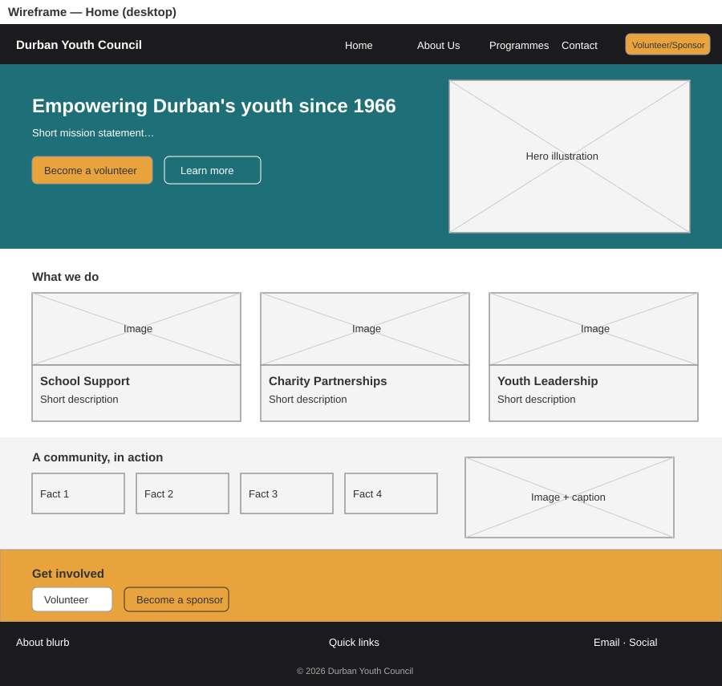
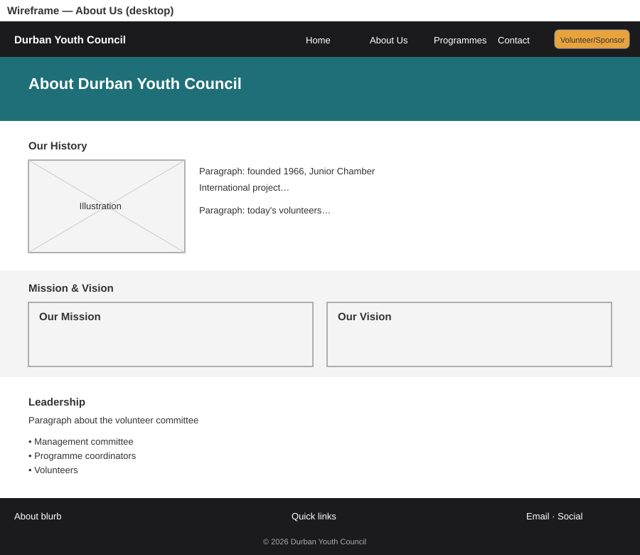
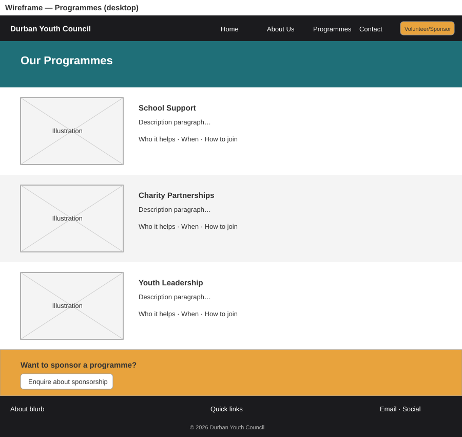
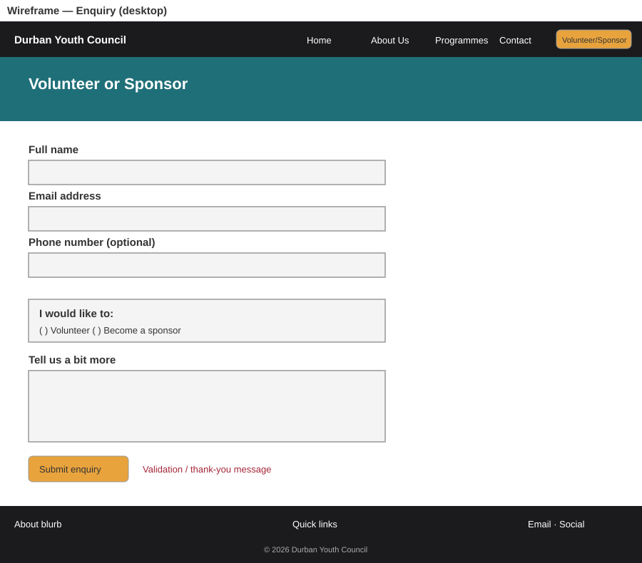
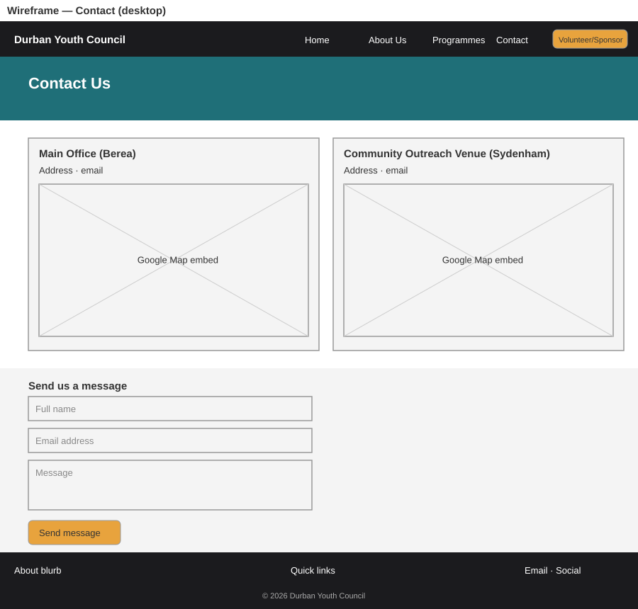
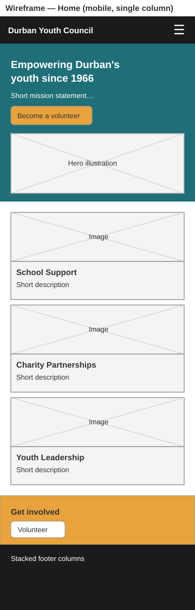

# 5. Wireframes

Low-fidelity layouts for each page. Grey boxes with crosses are image placeholders.

## Home (desktop)

## About Us (desktop)

## Programmes (desktop)

## Enquiry (desktop)

## Contact (desktop)

## Home (mobile)
Everything stacks into a single column and the navigation collapses behind a menu button.

## Sitemap

